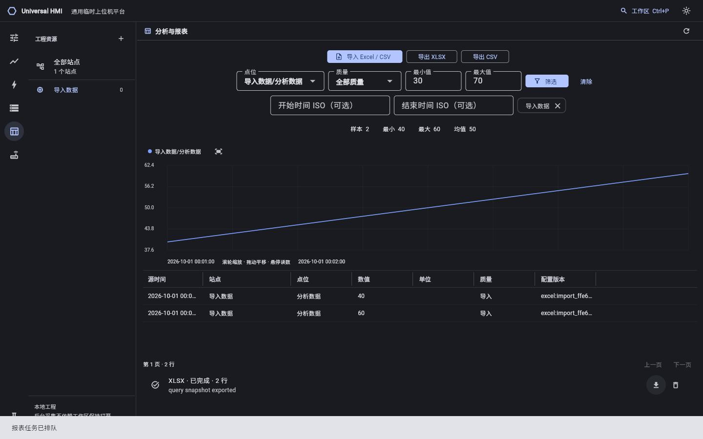
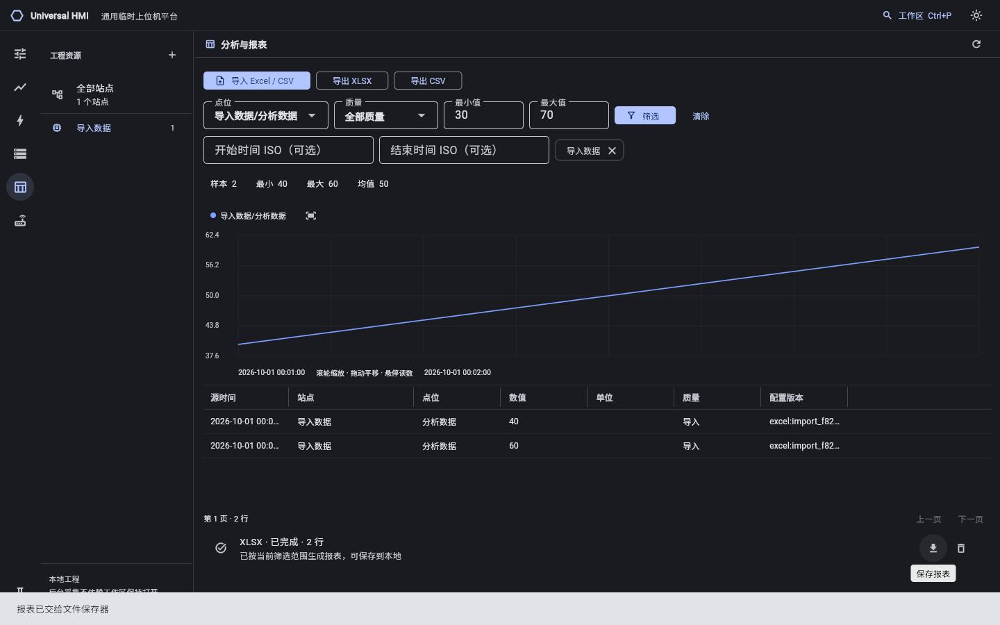

# 第一版阶段记录与评审材料

日期：2026-10-01。用户要求由 Dot 接手，当前是功能阶段交接，不宣称完整第一版评审交付或现场验收。

## 已通过阶段

源码 b47fc66248007b1a6e9a406881841fdfe2e3d975：
[CI 36801113430](https://github.com/YufeiSun5/universal-hmi/actions/runs/36801113430) 6/6 jobs success。

| 平台 / 流程 | 实际结果 |
| --- | --- |
| Go 1.24.7，Ubuntu 24.04 与 Windows 2022 | test -race、vet、build 通过 |
| Flutter 3.35.4，Web / Linux / Windows | analyze 无问题、4 个 widget 用例通过，release build 通过 |
| Linux 原生 runner + 真实 Go | 添加、草稿保存、显式应用、采样、快照、历史筛选、报表任务完成；960×600 / 1920×1080 无异常 |
| 本地 Mosquitto | 10 站 packed Kep、scale=2/offset=10、虚拟均值、坏质量不触发、AND 持续条件、写值与快照、历史、XLSX |
| generic MQTT 物理命令 fixture | 工程值 70→原值 30，sent、同命令只发布一次；实时读回保持源值，不伪造确认 |
| Chromium 真实文件交互 | CSV 20/40/60 导入；30–70 筛选后 count=2、min=40、max=60、mean=50；下载 XLSX 重读只有 40/60 |
| 打包 | Linux tar 与 Windows 完整目录均包含 Go 和 Flutter Web；该阶段尚未执行最终包自动启动验证 |

该阶段 CI 在构建前会格式化/修复源码；899a12e 已回填其真实生成源码/lock/runner，最终只读构建门禁尚需收尾。

## 截图

下面是上述已通过阶段的真实 Chromium 界面，数据来自实际导入与筛选，未使用生成图替代运行截图。

后续 Web 验证已通过，工具栏对齐、导入站点计数和报表文案已修正。以下为 899a12e 的真实新截图；原生截图及最终包仍等当前运行结果。截图时文件保存通知尚未完全消失，Dot 可等待其关闭后重新抓取评审图。

## 已通过阶段下载

- [Linux 完整包](https://github.com/YufeiSun5/universal-hmi/actions/runs/36801113430/artifacts/11135901640)：ZIP 内含 tar.gz；SHA-256 10581ce6c71dda431ebf187ff86dc4f710048b5da7f1f2c3199a27f3a248b585。
- [Windows 完整包](https://github.com/YufeiSun5/universal-hmi/actions/runs/36801113430/artifacts/11135711860)：SHA-256 6d7abf6bdbb44025b536d21d1e267666a940a1ae34609fa48b90c50b420ee3be。
- [Linux 原生截图](https://github.com/YufeiSun5/universal-hmi/actions/runs/36801113430/artifacts/11136490739)。
- [Web 深浅色截图与 XLSX](https://github.com/YufeiSun5/universal-hmi/actions/runs/36801113430/artifacts/11135418096)。

以上为 GitHub artifact ZIP 摘要，产物 2026-12-30 到期；登录 GitHub 下载。后续构建不可沿用这些摘要。

## 当前收尾批次

源码 899a12e1cde1849c20e3acb268fbf86d06ece980，
[CI 36883999289](https://github.com/YufeiSun5/universal-hmi/actions/runs/36883999289)。

已提交：工具栏/统计条左对齐、历史点位目录计数、报表状态文案、实时默认同单位曲线、模拟设定值周期新鲜读回、停止后的陈旧回归、独立 30 站原生截图和最终 Linux 包自动启动/Web 验证。交接时 Go 两项和 Flutter Web/Windows 已通过，Flutter Linux 仍在运行，最终打包项待前置结果。不能据上一轮通过声称此批全通过。

实际来源审阅参考：[edge-terminal-SPT](https://github.com/YufeiSun5/edge-terminal-SPT/tree/86173ae7784c55b303691a951dc65c35ccccc98e)。本版没有复制专用检测业务，独立 Lite 具体源码未定位。

会话环境启动失败，验证均在 CI 虚拟机；Windows 人工操作、厂商 ACK、独立多工程、远程认证与真实容量未验收。接手详见 [HANDOFF.md](../../HANDOFF.md)。
